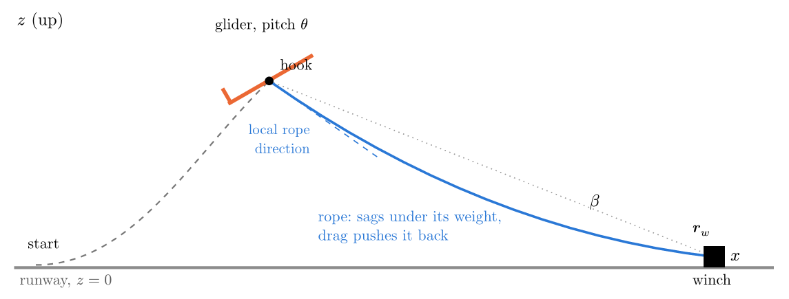
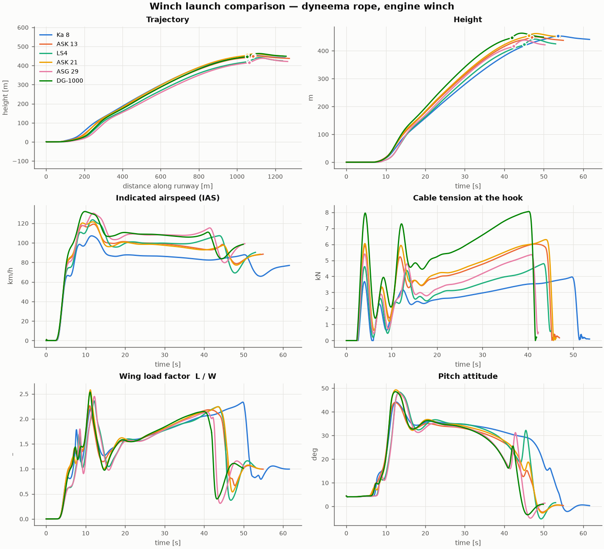
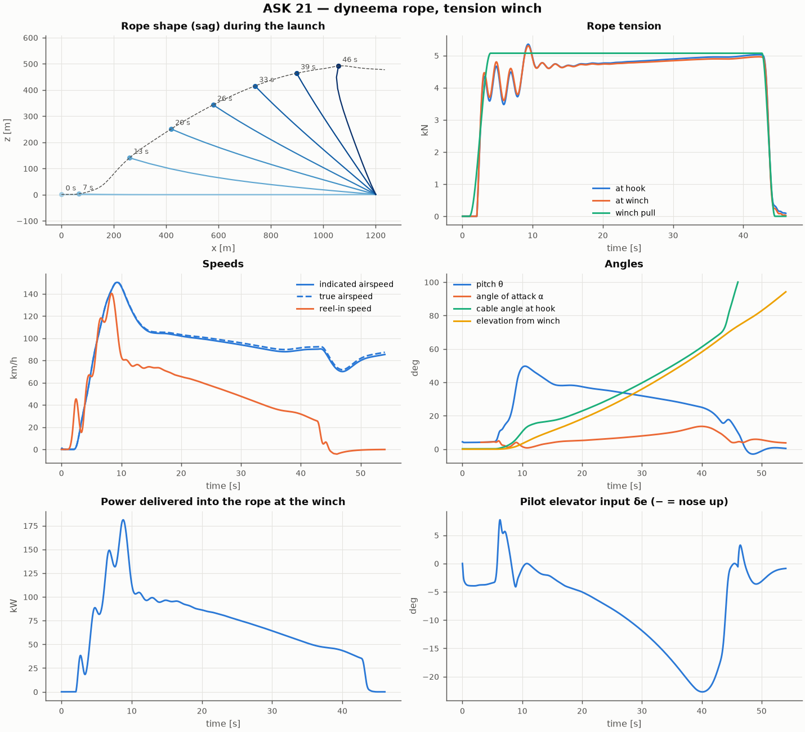
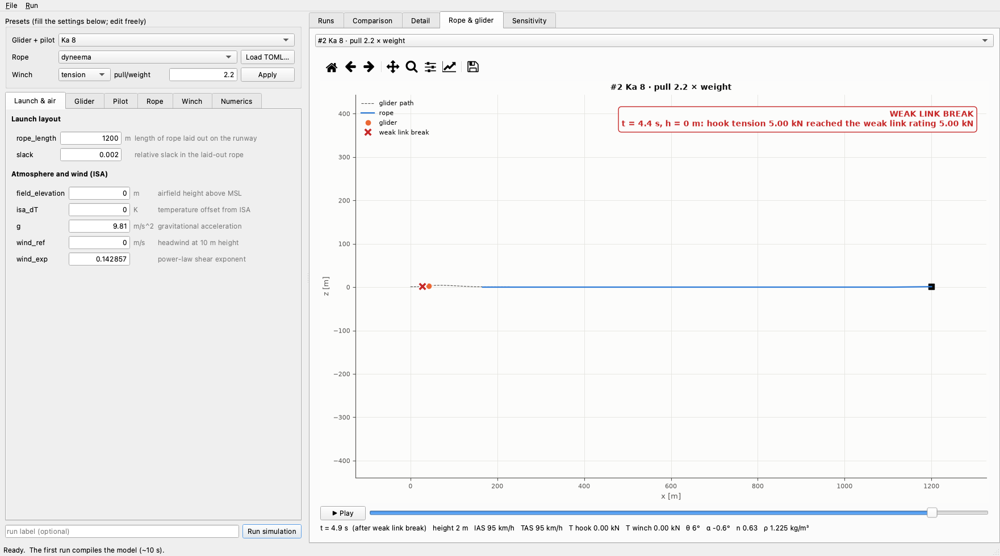

# winch-simulator

Simulator for glider winch launches, written in JAX and solved with
[diffrax](https://docs.kidger.site/diffrax/).

* 3-DOF longitudinal glider (translation + pitch) with aerodynamic polar, stall,
  pitch damping, tow-hook moment and wheel/skid ground contact
* lumped-mass rope with elasticity, weight, aerodynamic drag and rope-on-grass
  friction (steel and Dyneema presets)
* two winch models: tension-controlled, and power-limited engine
* pilot (attitude PID with rotation / climb / top-of-launch schedule) and winch driver
* release, back-release, weak-link and rope-in events; free flight after release
* sensitivities of the release height to all ~80 parameters, with units, via
  `jax.grad` through the ODE solve
* ropes from datasheet values (diameter, mass per 100 m, breaking load,
  elongation or EA) or TOML files
* ISA air density vs height (airfield elevation, ISA temperature offset);
  indicated vs true airspeed
* catalogue of gliders: Ka 8, ASK 13, LS4, ASK 21, ASG 29, DG-1000 (approximate data)



*The glider climbs on a rope that sags under its own weight and drag, so at the
hook it pulls more steeply downwards than the straight line to the winch
(β = elevation seen from the winch).*

The physics and the numerical approach are written up in Typst in
[`docs/physics.typ`](docs/physics.typ) (bibliography in `docs/refs.yml`). Build the
PDF with

```sh
typst compile docs/physics.typ    # -> docs/physics.pdf
```

## Example results

Six gliders on 1200 m of Dyneema with a power-limited engine winch
(`uv run main.py --winch engine`). Every launch ends the usual way: the winch
driver throttles down near the top, the rope goes slack and the tow hook's
back-release opens.



One launch in detail (ASK 21, tension winch): rope shapes during the climb,
tension at the winch and at the hook, speeds, angles, winch power and the pilot's
elevator input.



## Sensitivity of the release height

Every run also reports how much each of the ~80 parameters matters for the
release height. `jax.grad` differentiates straight through the ODE solve,
including the moment the launch ends. One backward pass gives ∂h/∂p for every
parameter, and the results agree with finite differences to within 0.5 %. Each
row shows the parameter's value and unit, ∂h/∂p (e.g. metres per mm of rope
diameter), the height change for +10 %, and the *elasticity* (% height per %
parameter). The table is sorted by elasticity. These are local values: for big
changes, such as steel vs Dyneema, run the simulation instead.

ASK 21, 1200 m Dyneema, tension winch (h = 491 m), largest effects:

| parameter | ∂h/∂p | Δh for +10 % | elasticity |
|---|---|---|---|
| rope length (1200 m) | 0.39 m/m | +47 m | 0.96 |
| winch pull (5.07 kN) | 51 m/kN | +26 m | 0.53 |
| glider mass (470 kg) | −0.48 m/kg | −23 m | −0.46 |
| pilot: end of nose lowering (70°) | 1.1 m/deg | +8 m | 0.15 |
| pilot: climb attitude (40°) | 1.5 m/deg | +6 m | 0.12 |
| pilot: target climb speed (105 km/h) | −0.57 m/(km/h) | −6 m | −0.12 |
| rope diameter (5 mm) | −6.8 m/mm | −3 m | −0.07 |
| rope drag coefficient (1.2) | −28 m | −3 m | −0.07 |

Rope length, winch pull and glider mass dominate. After them come the pilot's
technique and the rope's drag. Rope stretch (EA) hardly matters for height. The
full table is written to `results/sensitivity_<glider>_<rope>_<winch>.csv`, and
`--only rope` filters it.

## Desktop app

```sh
uv run winch-gui          # or: uv run python -m winch_sim.gui
```

A Qt (PySide6) window with:

* **settings:** every model parameter in tabs (launch & air, glider, pilot, rope,
  winch, numerics), shown in display units with the descriptions from
  `params.py`. Presets fill them in: a glider + pilot from the catalogue, a rope
  preset or TOML file, and a tension/engine winch scaled to the glider weight.
  Any value can then be edited.
* **Run simulation** (Ctrl+R), in a background thread. The first run compiles the
  model (~10 s).
* **results:**
  * *Runs*: summary table of all runs; tick runs to compare them, reload a run's
    settings, export a time series as CSV.
  * *Comparison* and *Detail*: the plots, with zoom/pan.
  * *Rope & glider*: rope shape and glider position with a time slider and playback.
  * *Sensitivity*: sortable, filterable table, exportable as CSV.
* **File → Save/Load settings** as JSON (SI units).



*Rope & glider view: a Ka 8 with the winch pulling 2.2 × its weight. The weak
link breaks during the ground run, and the banner shows why.*

## Usage

```sh
uv run main.py                                    # all gliders, Dyneema, tension winch
uv run main.py --rope steel --winch engine
uv run main.py --gliders "ASK 21" LS4 --pull 1.0 --rope-length 1000 --wind 5
uv run main.py --rope-file ropes/example_dyneema_6mm.toml    # rope from a datasheet
uv run main.py --rope steel --rope-param mu=0.09 --rope-param EA=1.2e6
uv run main.py --gliders "ASK 13" --only rope   # sensitivity table: rope parameters only
uv run main.py --field-elevation 1500 --isa-dt 15 # hot, high airfield (ISA atmosphere)
uv run main.py --rope-length 10000 --segments-per-km 10 --t-max 20000
uv run pytest
```

`main.py` prints a comparison table, writes plots to `results/`, and prints the
sensitivity of the release height to every parameter (CSV in `results/`;
`--no-sensitivity` skips it).

From Python:

```python
import winch_sim
from winch_sim.gliders import CATALOGUE
from winch_sim.cable import STEEL
from winch_sim.winch import tension_winch
from winch_sim.params import Env, Launch
from winch_sim.simulate import solve_launch, summarize, time_series

glider, pilot = CATALOGUE["ASK 21"]
launch = Launch(
    glider=glider,
    rope=STEEL,
    winch=tension_winch(glider, 1.1),
    pilot=pilot,
    env=Env(wind_ref=3.0),
    rope_length=1200.0,
    slack=0.002,
)
sol = solve_launch(launch, n_segments=12)
print(summarize(launch, sol))
series = time_series(launch, sol)  # numpy arrays for plotting
```

`simulate.solve_batch([...])` runs many launches as one `vmap`-ed program.

## Layout

| file | contents |
|---|---|
| `winch_sim/params.py` | parameter pytrees (`Glider`, `Rope`, `Winch`, `Pilot`, `Env`, `Launch`) |
| `winch_sim/gliders.py` | glider catalogue and handbook-data → coefficients |
| `winch_sim/aero.py` | wind, air data, lift/drag/moment |
| `winch_sim/cable.py` | lumped-mass rope, rope presets, elastic catenary (validation) |
| `winch_sim/winch.py` | winch models and presets |
| `winch_sim/pilot.py` | pilot model |
| `winch_sim/ground.py` | smooth ground contact |
| `winch_sim/dynamics.py` | state, vector field, diagnostics |
| `winch_sim/simulate.py` | diffrax solve with events, batching, summaries |
| `winch_sim/sensitivity.py` | d(release height)/d(parameter) via `jax.grad` |
| `ropes/*.toml` | example rope definitions |
| `winch_sim/plots.py` | figures |
| `winch_sim/report.py` | summary columns, sensitivity CSV (shared by CLI and GUI) |
| `winch_sim/gui/` | Qt desktop app (`app.py`), auto-generated settings forms (`forms.py`) |
